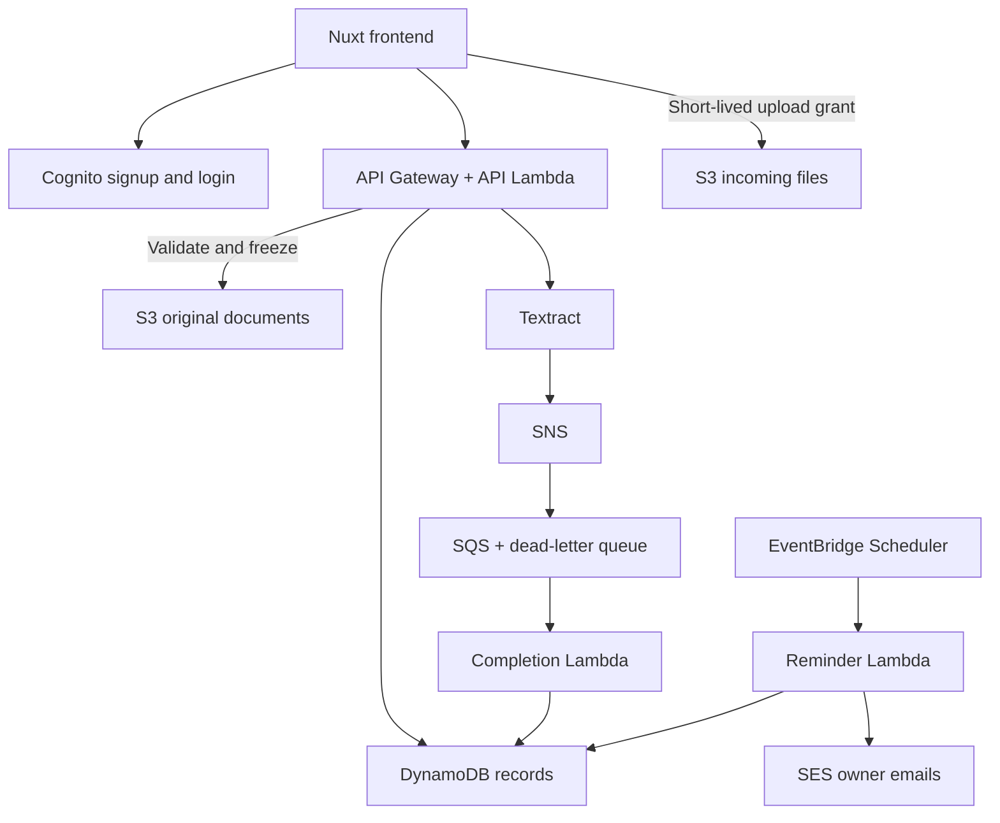

# Invoxa

Invoice management for Indian small businesses: upload a supplier bill, review its details, and track payment. Nuxt 4, Vue, TypeScript and Tailwind CSS, with a working local backend and separate AWS Lambda adapters.

**Status:** local core workflow implemented and tested. AWS integration code is supplied but has not been deployed or verified in a real AWS account. Do not describe this as a production-ready accounting platform.

## Run locally

Use Node **24.11+** (Node 24 LTS recommended) or Node **22.19+**. The machine's older Node 22.14 will not satisfy the patched Nuxt release.

```sh
npm ci
npm run dev -- --host 127.0.0.1
```

Open the URL printed by Nuxt. Choose **Create a test account**, enter a test email and a unique password of at least 12 characters, and name your workspace. No email verification is sent locally. Upload `docs/samples/sample-invoice.pdf` for a synthetic test.

Data and password hashes persist in `.data/` across refreshes/restarts; session cookies last 24 hours. This directory is ignored by Git and should stay private. The local backend allows only loopback hosts, requires matching request Origin for writes, and is intended for one process on one computer. No AWS services are called in local mode. Do not publicly deploy local mode or use it for production financial records.

To move local test data out of the way without deleting it, stop the server and rename `.data` to a backup directory before restarting. That creates a fresh workspace store. Never reset it while the server is running.

## What works

- Local signup/login/logout, password hashing, persistent sessions, one owner per workspace.
- Cognito hosted signup/login/recovery wiring with authorization code + PKCE for AWS mode.
- PDF, JPEG and PNG uploads, file-size/type checks, PDF page limits, frozen originals, authenticated previews.
- Manual invoice entry locally; asynchronous Textract extraction and confidence/date warnings in the AWS adapter.
- Review before confirmation; exact integer-paise amounts; required-field and total-difference checks.
- Edit, mark fully paid/unpaid, archive/restore, optimistic-write conflict detection.
- Search, supplier/status/date filters, active/archive views, pagination and CSV export.
- Outstanding/overdue/due-soon totals, monthly invoice/GST amounts and top suppliers.
- Saved opt-in reminder preferences and local preview; daily SES reminder Lambda with deduplication.
- Workspace isolation, conditional quota counters and limited API bodies; AWS JWT checks and verified-email lookup.

Pilot limits: INR, supplier bills, one invoice per file, 8 MB, 10 PDF pages, 50 upload reservations per workspace per UTC day, 1,000 reservations total. Unconfirmed/archived bills are excluded from summaries. "This month's recorded bills" uses invoice date, not payment date. Overdue calculations use today's date in Asia/Kolkata.

## Verify

```sh
npm test
npm run typecheck
npm run typecheck:backend
npm run build
npm run build:backend
```

With the local development server running:

```sh
npm run test:smoke
npm run reminders:local
```

The smoke test creates its own synthetic local account and PDF. The reminder command prints preview counts only; it does not send email or consume reminder claims.

### Try the user journey

1. Create your local test account and workspace.
2. Upload the supplied sample PDF; the source appears beside a blank manual-entry form.
3. Enter ABC Traders, INV-2041, 2026-09-02, due 2026-10-02, subtotal 42000, GST 7560, total 49560, unpaid.
4. Change the total by one rupee: a difference acknowledgement appears. Restore the printed total.
5. Check the review acknowledgement and confirm. The list should show ₹49,560 and Overview should include it as outstanding.
6. Open it and mark paid. Outstanding should decrease by ₹49,560; recorded monthly invoice totals remain unchanged.
7. Archive, filter Archived, restore, search, and export CSV.
8. Enable reminders in Settings and preview them. Local mode sends nothing.
9. Sign out; protected routes return to sign-in. Sign in again to see persisted records.
10. Use another test account to verify its invoice list is separate.

## AWS setup is yours

See **[docs/AWS-SETUP.md](docs/AWS-SETUP.md)** for exact resource contracts, costs, permissions, Cognito callbacks/scopes, environment variables, queues, schedules, CORS, packaging and acceptance tests. **[docs/API.md](docs/API.md)** documents the API. Copy `.env.example` when configuring an environment; no secrets belong in `NUXT_PUBLIC_*` variables.

`npm run build:backend` creates `dist/lambda/api`, `dist/lambda/extraction-complete`, and `dist/lambda/reminders`. Prebuilt ZIP archives are also supplied alongside those directories in `dist/lambda/`; rebuild and re-zip after source changes. Each directory is a separate deployable bundle with `index.handler`; zip the contents, not the parent directory. Creating/deploying these resources is not automated by this repository.

## Architecture



## Known limits / production gate

- Real AWS integration, IAM, email delivery and OCR accuracy must be tested after configuration. Automatic extraction never runs locally.
- The AWS SPA retains its short-lived access token in sessionStorage; no automatic refresh is implemented. After expiry it asks for sign-in. Use strict CSP/HTTPS and review a server-session design before production.
- PDF validation is not antivirus. JPEG/PNG validation checks file signatures; deploy malware scanning and stronger image validation for hostile production uploads.
- No permanent-delete/retention workflow, invitations, partial payments, payment gateway, subscription billing, bank sync, GST compliance calculations, AI chat or RAG.
- Reminder send failures can leave a claimed notification for operator review; automatic resend could send a duplicate.
- Completion polling stops after roughly two minutes; manual entry remains available. Failed AWS extraction must be investigated before retrying paid processing.
- Search and aggregation load a workspace's bounded pilot dataset. Revisit indexes/server-side querying before raising the pilot limit.
- Customer demand and willingness to pay remain unvalidated. Demonstrate this workflow to real businesses before adding features.

Validation details and remaining checks: **[docs/VALIDATION.md](docs/VALIDATION.md)**.
